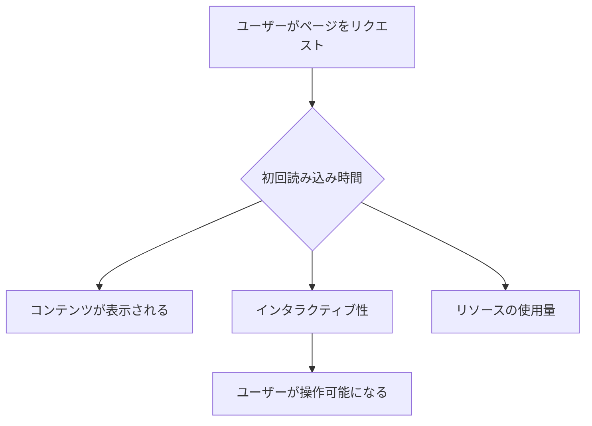
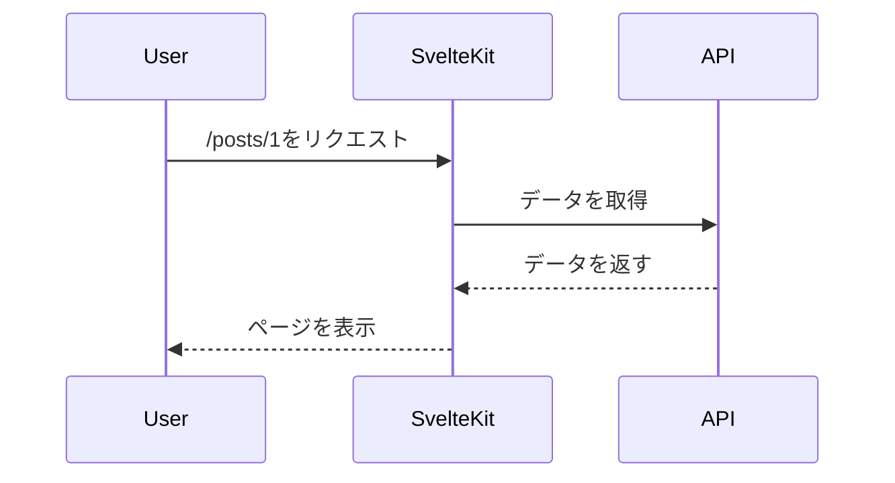

# SvelteKitで始める高速Webアプリ開発：ReactとNext.jsとの比較と移行戦略

## はじめに

Webアプリケーションの開発は、近年急速に進化しており、さまざまなフレームワークやライブラリが登場しています。その中でも、SvelteKitは新しいアプローチを提供し、開発者にとって魅力的な選択肢となっています。本記事では、SvelteKitを用いた高速Webアプリ開発の利点を探り、特にReactとNext.jsとの比較を行い、移行戦略についても詳しく解説します。

### SvelteKitとは？

SvelteKitは、Svelteを基盤としたフルスタックのフレームワークで、サーバーサイドレンダリング（SSR）や静的サイト生成（SSG）をサポートしています。Svelte自体は、コンパイラ型のフレームワークであり、他のフレームワークとは異なり、ランタイムのオーバーヘッドが少なく、パフォーマンスが非常に高いのが特徴です。SvelteKitは、開発者が迅速にアプリケーションを構築できるように設計されており、特にパフォーマンスと開発体験に重点を置いています。

### ReactとNext.jsの概要

Reactは、Facebookが開発したユーザーインターフェースライブラリで、コンポーネントベースのアプローチを採用しています。Reactは、仮想DOMを使用して効率的にUIを更新するため、パフォーマンスが高いとされています。Next.jsは、Reactの上に構築されたフレームワークで、SSRやSSGを簡単に実装できる機能を提供します。これにより、SEOやパフォーマンスの向上が期待できます。Next.jsは、特に大規模なアプリケーションやコンテンツ重視のサイトに適しています。

## SvelteKitの特徴

### 1. 高速なパフォーマンス

SvelteKitは、コンパイラ型のアプローチを採用しているため、アプリケーションのビルド時に不要なコードを削減し、最適化されたJavaScriptを生成します。これにより、ページの読み込み速度が向上し、ユーザー体験が向上します。SvelteKitは、クライアントサイドのJavaScriptを最小限に抑えることで、初回のページ読み込みが非常に速くなります。特に、モバイルデバイスや低速なネットワーク環境でのパフォーマンスが向上します。

#### パフォーマンスの測定

SvelteKitのパフォーマンスを測定するためには、以下のような指標を考慮することが重要です。

- **初回読み込み時間**: ユーザーがページをリクエストしてから、最初のコンテンツが表示されるまでの時間。
- **インタラクティブ性**: ページが表示された後、ユーザーが操作できるようになるまでの時間。
- **リソースの使用量**: CPUやメモリの使用量、特にモバイルデバイスでのパフォーマンス。

これらの指標を測定するためには、GoogleのPageSpeed InsightsやLighthouseなどのツールを使用することができます。



このフローチャートは、SvelteKitのパフォーマンス測定の流れを示しています。ユーザーがページをリクエストすると、初回読み込み時間が計測され、コンテンツが表示されるまでの時間やインタラクティブ性、リソースの使用量が評価されます。

### 2. シンプルな構文

SvelteKitは、シンプルで直感的な構文を提供しており、開発者が迅速に学習し、プロジェクトを立ち上げることができます。以下は、SvelteKitでの基本的なコンポーネントの例です。

```svelte
<script>
  let name = 'World';
</script>

<h1>Hello {name}!</h1>
```

このように、SvelteKitでは、HTMLとJavaScriptが同じファイル内で簡潔に記述できるため、開発者はコンポーネントの構造を直感的に理解しやすくなります。また、SvelteKitは、CSSも同じファイル内に記述できるため、スタイルの管理が容易です。

#### スタイルのスコープ

SvelteKitでは、各コンポーネント内で定義されたCSSは、そのコンポーネントにのみ適用されるため、スタイルの衝突を避けることができます。これにより、開発者はスタイルを気にせずにコンポーネントを作成でき、メンテナンスが容易になります。

### 3. 組み込みのルーティング

SvelteKitは、ファイルベースのルーティングを採用しており、ディレクトリ構造に基づいて自動的にルートを生成します。これにより、ルーティングの設定が簡素化され、開発者はビジネスロジックに集中できます。例えば、`src/routes`ディレクトリ内に`about.svelte`というファイルを作成するだけで、`/about`というルートが自動的に生成されます。

#### 動的ルーティング

SvelteKitでは、動的ルーティングも簡単に実装できます。例えば、`src/routes/posts/[id].svelte`というファイルを作成することで、`/posts/1`や`/posts/2`のような動的なURLを処理できます。この場合、`[id]`はURLパラメータとして扱われ、コンポーネント内でアクセスすることができます。



このシーケンス図は、SvelteKitが動的ルーティングを処理する流れを示しています。ユーザーが特定のポストをリクエストすると、SvelteKitはAPIからデータを取得し、ページを表示します。

### 4. SSRとSSGのサポート

SvelteKitは、サーバーサイドレンダリング（SSR）と静的サイト生成（SSG）の両方をサポートしています。これにより、SEO対策や初回読み込み速度の向上が可能です。以下は、SSRを使用した例です。

```javascript
export async function load({ params }) {
  const res = await fetch(`https://api.example.com/data/${params.id}`);
  const data = await res.json();
  return { props: { data } };
}
```

このように、SvelteKitでは、データを事前に取得し、ページがレンダリングされる前に必要な情報を提供することができます。これにより、ユーザーはページが表示される前にコンテンツを待つ必要がなくなります。

#### SSGの利点

静的サイト生成（SSG）は、特にコンテンツが頻繁に変わらないサイトに適しています。SvelteKitでは、ビルド時にすべてのページを生成するため、サーバーの負荷が軽減され、ページの読み込み速度が向上します。これにより、SEOの向上やユーザー体験の改善が期待できます。

## ReactとNext.jsとの比較

### 1. パフォーマンス

SvelteKitは、コンパイラ型のアプローチにより、ReactやNext.jsよりも優れたパフォーマンスを発揮することが多いです。特に、初回のページ読み込み速度が速く、ユーザー体験を向上させます。Reactは仮想DOMを使用して効率的にUIを更新しますが、SvelteKitはコンパイラによって事前に最適化されたコードを生成するため、ランタイムのオーバーヘッドが少なくなります。

#### パフォーマンスの比較

- **初回読み込み時間**: SvelteKitは、ビルド時に最適化されたコードを生成するため、初回の読み込みが非常に速いです。ReactやNext.jsは、仮想DOMを使用するため、初回のレンダリングに時間がかかることがあります。
- **インタラクティブ性**: SvelteKitは、クライアントサイドのJavaScriptを最小限に抑えるため、インタラクティブ性が高いです。ReactやNext.jsは、クライアントサイドでの処理が多くなるため、インタラクティブ性が低下することがあります。

### 2. 学習曲線

SvelteKitは、シンプルな構文と直感的なAPIを提供しているため、ReactやNext.jsに比べて学習曲線が緩やかです。特に、JavaScriptの基本を理解している開発者にとっては、すぐに使い始めることができます。Reactは、コンポーネントのライフサイクルや状態管理の概念を理解する必要があり、学習に時間がかかることがあります。

#### 学習リソース

SvelteKitの学習をサポートするために、以下のリソースを活用することができます。

- **公式ドキュメント**: SvelteKitの公式ドキュメントは、基本的な使い方から高度な機能まで幅広くカバーしています。
- **チュートリアル**: SvelteKitのチュートリアルを通じて、実際のプロジェクトを構築しながら学ぶことができます。
- **コミュニティフォーラム**: SvelteKitのコミュニティフォーラムでは、他の開発者と情報交換を行い、疑問を解決することができます。

### 3. エコシステムとコミュニティ

ReactとNext.jsは、広範なエコシステムと活発なコミュニティを持っています。これに対して、SvelteKitは比較的新しいフレームワークであり、エコシステムはまだ発展途上ですが、急速に成長しています。SvelteKitのコミュニティは、ドキュメントやチュートリアルが充実しており、開発者が学びやすい環境が整っています。

#### エコシステムの成長

SvelteKitのエコシステムは、プラグインやライブラリの追加により急速に成長しています。これにより、開発者は必要な機能を簡単に追加でき、プロジェクトの拡張性が向上します。例えば、SvelteKit用の認証ライブラリやデータ管理ライブラリが登場しており、これらを活用することで開発がスムーズになります。

### 4. 開発体験

SvelteKitは、開発者の生産性を向上させるための機能が豊富です。ホットリローディングやエラーハンドリングが組み込まれており、開発中のフィードバックが迅速に得られます。これにより、開発者はコードを変更した際に即座に結果を確認でき、効率的に開発を進めることができます。

#### 開発ツールの統合

SvelteKitは、さまざまな開発ツールと統合が容易です。例えば、ESLintやPrettierを使用してコードの品質を保つことができ、GitHub Actionsを使用してCI/CDパイプラインを構築することも可能です。これにより、開発者は効率的にプロジェクトを管理できます。

## SvelteKitへの移行戦略

### 1. プロジェクトの評価

移行を検討する際は、現在のプロジェクトの規模や複雑さを評価することが重要です。小規模なプロジェクトであれば、SvelteKitへの移行は比較的容易ですが、大規模なプロジェクトでは、段階的な移行が推奨されます。移行の際には、既存のコードベースを分析し、どの部分がSvelteKitに適しているかを見極めることが重要です。

#### 移行の計画

移行を成功させるためには、以下のステップを考慮することが重要です。

1. **プロジェクトの分析**: 現在のプロジェクトの構造や依存関係を分析し、移行に必要な作業をリストアップします。
2. **段階的な移行**: 大規模なプロジェクトの場合、機能ごとに段階的に移行を行うことが推奨されます。これにより、リスクを最小限に抑えることができます。
3. **テストの実施**: 移行後は、アプリケーションのテストを行い、機能が正しく動作することを確認します。

### 2. コンポーネントの再利用

Reactで作成したコンポーネントをSvelteKitに移行する際は、コンポーネントのロジックを再利用することができます。SvelteKitでは、JavaScriptのロジックをそのまま使用できるため、移行作業がスムーズに進みます。特に、ビジネスロジックやAPIとの通信部分は、SvelteKitに適応させることが容易です。

#### コンポーネントの変換

ReactコンポーネントをSvelteコンポーネントに変換する際は、以下の点に注意が必要です。

- **プロパティの受け渡し**: Reactでは`props`を使用しますが、Svelteでは`export`を使用してプロパティを受け渡します。
- **状態管理**: Reactの`useState`フックをSvelteのストアに置き換える必要があります。
- **ライフサイクルメソッド**: Reactのライフサイクルメソッドは、Svelteでは`onMount`や`beforeUpdate`などのフックに置き換えられます。

### 3. ステート管理の見直し

Reactでは、ReduxやContext APIを使用してステート管理を行いますが、SvelteKitでは、Svelteのストアを使用することが一般的です。移行の際は、ステート管理の方法を見直し、Svelteのストアに適応させる必要があります。Svelteのストアは、シンプルで直感的なAPIを提供しており、状態の管理が容易です。

#### ストアの使用例

Svelteのストアを使用することで、アプリケーション全体で状態を共有することができます。以下は、ストアの基本的な使用例です。

```javascript
import { writable } from 'svelte/store';

export const count = writable(0);
```

このストアを使用することで、複数のコンポーネント間で状態を簡単に共有できます。

### 4. ルーティングの再構築

SvelteKitはファイルベースのルーティングを採用しているため、Reactで設定したルーティングをSvelteKitに合わせて再構築する必要があります。これにより、ルーティングの設定が簡素化されます。例えば、Reactでのルーティング設定をSvelteKitに移行する際は、各ページを`src/routes`ディレクトリに配置するだけで、自動的にルートが生成されます。

#### ルーティングの最適化

SvelteKitでは、ルーティングを最適化するために、以下の点を考慮することが重要です。

- **ネストされたルート**: SvelteKitでは、ネストされたルートを簡単に作成できます。これにより、複雑なアプリケーションの構造を整理できます。
- **エラーハンドリング**: ルーティングにおけるエラーハンドリングを適切に行うことで、ユーザーに対して良好な体験を提供できます。

### 5. テストとデバッグ

移行後は、アプリケーションのテストとデバッグを行い、機能が正しく動作することを確認します。SvelteKitには、テストフレームワークとの統合が容易であり、テストの実施がスムーズです。JestやCypressなどのテストツールを使用して、ユニットテストやエンドツーエンドテストを実施することができます。

#### テストのベストプラクティス

テストを効果的に実施するためには、以下のベストプラクティスを考慮することが重要です。

- **ユニットテスト**: 各コンポーネントや関数の動作を確認するために、ユニットテストを実施します。
- **エンドツーエンドテスト**: ユーザーの操作をシミュレートし、アプリケーション全体の動作を確認します。
- **継続的インテグレーション**: CI/CDパイプラインを構築し、テストを自動化することで、品質を保ちながら迅速な開発を実現します。

## まとめ

SvelteKitは、高速で効率的なWebアプリケーション開発を可能にするフレームワークです。ReactやNext.jsと比較して、パフォーマンスや学習曲線において優れた特性を持っています。移行戦略を適切に計画し、段階的に進めることで、既存のプロジェクトをSvelteKitに移行することが可能です。

SvelteKitの導入を検討している開発者は、その特性を理解し、実際のプロジェクトに適用することで、より良いユーザー体験を提供できるでしょう。今後のWeb開発において、SvelteKitはますます重要な役割を果たすと考えられます。

## 参考文献

- [SvelteKit公式ドキュメント](https://kit.svelte.dev/docs)
- [React公式ドキュメント](https://reactjs.org/docs/getting-started.html)
- [Next.js公式ドキュメント](https://nextjs.org/docs)

-----

※本記事は生成AIを使用して作成されました。
AI言語モデル: gpt-4o-mini