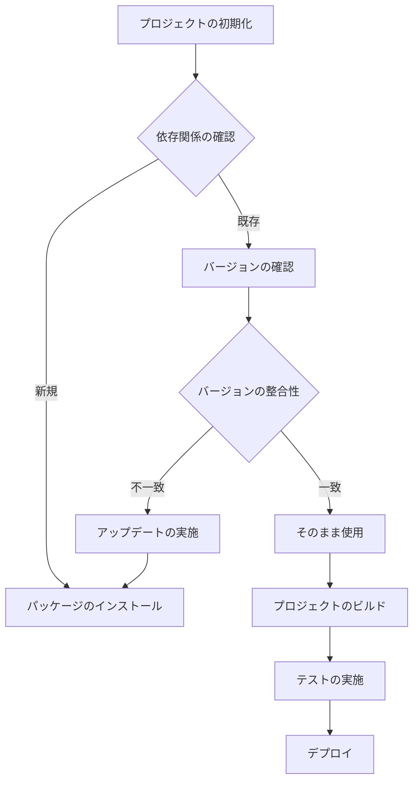

# フロントエンドのパッケージマネージメント2024：npm、Yarn、pnpmの最新比較

## はじめに

フロントエンド開発において、パッケージマネージャーは不可欠なツールです。これらのツールは、ライブラリやフレームワークの管理を簡素化し、開発者が効率的に作業できる環境を提供します。2024年において、最も人気のあるパッケージマネージャーであるnpm、Yarn、pnpmの最新情報を比較し、それぞれの特徴や利点、使用シーンについて詳しく解説します。

### パッケージマネージャーの役割

パッケージマネージャーは、ソフトウェアの依存関係を管理し、インストール、アップデート、削除を行うツールです。これにより、開発者は手動でライブラリを管理する手間を省き、プロジェクトの構成を簡素化できます。特にフロントエンド開発では、さまざまなライブラリやフレームワークが使用されるため、パッケージマネージャーの重要性は増しています。

### パッケージマネージャーの基本機能

1. **依存関係の解決**: プロジェクトが依存するライブラリやモジュールを自動的にインストールし、バージョンの整合性を保ちます。これにより、開発者は手動で依存関係を管理する必要がなくなります。

2. **バージョン管理**: 各パッケージのバージョンを管理し、特定のバージョンを指定してインストールすることができます。これにより、プロジェクトの安定性を保つことができます。

3. **スクリプトの実行**: プロジェクト内で定義したスクリプトを簡単に実行できる機能を提供します。これにより、ビルドやテストのプロセスを自動化できます。

4. **セキュリティ管理**: 依存関係の脆弱性をチェックし、必要に応じてアップデートを促します。これにより、開発者は安全な環境で作業できます。

### パッケージマネージャーのフロー

以下のフローチャートは、パッケージマネージャーがどのように依存関係を解決し、パッケージを管理するかを示しています。



このフローチャートは、プロジェクトの初期化からデプロイまでの流れを示しています。依存関係の確認を行い、新規パッケージのインストールや既存パッケージのバージョン確認を行います。バージョンの整合性が取れている場合はそのまま使用し、不一致の場合はアップデートを実施します。最終的に、プロジェクトのビルド、テスト、デプロイが行われます。

## npm（Node Package Manager）

### 概要

npmはNode.jsの公式パッケージマネージャーであり、JavaScriptのエコシステムにおいて最も広く使用されています。npmは、パッケージのインストール、バージョン管理、依存関係の解決を行うための強力なツールです。

### 特徴

- **豊富なパッケージ**: npmは数百万のパッケージを提供しており、開発者は必要なライブラリを簡単に見つけてインストールできます。npmのリポジトリには、フロントエンドフレームワーク（React、Vue.jsなど）、ユーティリティライブラリ（Lodash、Moment.jsなど）、テストフレームワーク（Jest、Mochaなど）など、さまざまなパッケージが揃っています。

- **バージョン管理**: npmは、パッケージのバージョンを指定してインストールすることができ、特定のバージョンを使用することで、プロジェクトの安定性を保つことができます。バージョン指定は、セマンティックバージョニング（SemVer）に基づいて行われ、メジャー、マイナー、パッチのバージョンを明示的に指定できます。

- **スクリプト機能**: npmは、プロジェクト内でスクリプトを定義し、簡単に実行できる機能を提供しています。これにより、ビルドやテストのプロセスを自動化できます。たとえば、`package.json`ファイルに以下のようにスクリプトを定義することができます。

```json
{
  "scripts": {
    "start": "node server.js",
    "test": "jest"
  }
}
```

これにより、`npm start`や`npm test`コマンドでそれぞれのスクリプトを実行できます。

### 使用例

以下は、npmを使用してパッケージをインストールする基本的なコマンドです。

```bash
npm install <package-name>
```

特定のバージョンをインストールする場合は、次のように指定します。

```bash
npm install <package-name>@<version>
```

### 最新のアップデート

2024年には、npmはパフォーマンスの向上やセキュリティ機能の強化が行われました。特に、`npm audit`コマンドを使用して依存関係の脆弱性をチェックする機能が強化され、開発者はより安全な環境で作業できるようになりました。また、npm v8以降では、インストール速度の向上や、パッケージのキャッシュ機能が改善され、より効率的な開発が可能になっています。

## Yarn

### 概要

YarnはFacebookによって開発されたパッケージマネージャーで、npmの代替として人気を集めています。Yarnは、特に大規模なプロジェクトにおいて、パフォーマンスと安定性を重視しています。

### 特徴

- **高速なインストール**: Yarnは、依存関係をキャッシュすることで、パッケージのインストールを高速化します。これにより、同じパッケージを再インストールする際の時間を大幅に短縮できます。Yarnは、インストール時に並列処理を行うため、複数のパッケージを同時にインストールすることが可能です。

- **ロックファイル**: Yarnは`yarn.lock`ファイルを使用して、依存関係のバージョンを固定します。これにより、チーム全体で同じ環境を再現することが容易になります。`yarn.lock`ファイルは、プロジェクトの依存関係を正確に記録し、他の開発者が同じバージョンのパッケージをインストールできるようにします。

- **オフラインモード**: Yarnは、以前にインストールしたパッケージをオフラインで使用できる機能を提供しています。これにより、インターネット接続がない環境でも作業が可能です。Yarnは、インストールしたパッケージをローカルにキャッシュし、次回のインストール時に再利用します。

### 使用例

Yarnを使用してパッケージをインストールする基本的なコマンドは以下の通りです。

```bash
yarn add <package-name>
```

特定のバージョンをインストールする場合は、次のように指定します。

```bash
yarn add <package-name>@<version>
```

### 最新のアップデート

2024年には、Yarnは新しいプラグインシステムを導入し、開発者が独自の機能を追加できるようになりました。また、パフォーマンスの向上が図られ、特に大規模なプロジェクトでの使用が推奨されています。Yarn v2以降では、モノレポのサポートが強化され、複数のパッケージを一元管理することが容易になりました。

## pnpm

### 概要

pnpmは、npmやYarnの代替として登場した新しいパッケージマネージャーです。pnpmは、特にディスクスペースの節約とパフォーマンスの向上を目指しています。

### 特徴

- **シンボリックリンク**: pnpmは、パッケージをグローバルにインストールし、プロジェクトごとにシンボリックリンクを作成することで、ディスクスペースを節約します。これにより、同じパッケージを複数のプロジェクトで共有できます。シンボリックリンクを使用することで、重複したパッケージのインストールを避け、ディスク使用量を大幅に削減します。

- **高速なインストール**: pnpmは、依存関係の解決を効率的に行うため、インストール速度が非常に速いです。pnpmは、依存関係をキャッシュし、必要なパッケージを迅速に取得するため、特に大規模なプロジェクトでの使用に適しています。

- **厳格な依存関係管理**: pnpmは、依存関係の解決において厳格なルールを適用し、開発者が意図しない依存関係の混乱を防ぎます。これにより、プロジェクトの安定性が向上し、依存関係のバージョンの不整合を防ぐことができます。

### 使用例

pnpmを使用してパッケージをインストールする基本的なコマンドは以下の通りです。

```bash
pnpm add <package-name>
```

特定のバージョンをインストールする場合は、次のように指定します。

```bash
pnpm add <package-name>@<version>
```

### 最新のアップデート

2024年には、pnpmは新しいプラグインシステムを導入し、開発者が独自の機能を追加できるようになりました。また、パフォーマンスの向上が図られ、特に大規模なプロジェクトでの使用が推奨されています。pnpm v7以降では、モノレポのサポートが強化され、複数のパッケージを一元管理することが容易になりました。

## npm、Yarn、pnpmの比較

### パフォーマンス

- **npm**: 依存関係の解決が遅くなることがありますが、最近のアップデートで改善されています。特に、npm v8以降では、インストール速度が向上し、キャッシュ機能が強化されています。
  
- **Yarn**: 高速なインストールが特徴で、大規模プロジェクトに適しています。特に、並列処理を行うことで、複数のパッケージを同時にインストールすることが可能です。

- **pnpm**: シンボリックリンクを使用することで、ディスクスペースを節約しつつ、高速なインストールを実現しています。pnpmは、依存関係の解決を効率的に行うため、特に大規模なプロジェクトでの使用に適しています。

### 依存関係管理

- **npm**: `package-lock.json`を使用して依存関係を管理します。これにより、プロジェクトの依存関係のバージョンを固定し、他の開発者が同じ環境を再現できるようにします。

- **Yarn**: `yarn.lock`を使用して依存関係を固定します。これにより、チーム全体で同じ環境を再現することが容易になります。

- **pnpm**: 厳格な依存関係管理を行い、意図しない依存関係の混乱を防ぎます。pnpmは、依存関係のバージョンの不整合を防ぐため、開発者が意図しないパッケージのインストールを防ぎます。

### ユーザーエクスペリエンス

- **npm**: シンプルで使いやすいですが、パフォーマンスに課題があります。特に、大規模なプロジェクトでは、依存関係の解決に時間がかかることがあります。

- **Yarn**: 高速で、オフラインモードやロックファイルの機能が便利です。特に、チームでの開発において、同じ環境を再現するための機能が充実しています。

- **pnpm**: ディスクスペースの節約とパフォーマンスの向上が特徴で、特に大規模プロジェクトに適しています。pnpmは、シンボリックリンクを使用することで、重複したパッケージのインストールを避け、ディスク使用量を大幅に削減します。

## まとめ

2024年におけるフロントエンドのパッケージマネージメントは、npm、Yarn、pnpmの3つの主要なツールによって支えられています。それぞれのツールには独自の特徴と利点があり、プロジェクトのニーズに応じて選択することが重要です。npmは広く普及しており、Yarnはパフォーマンスを重視した選択肢、pnpmはディスクスペースの節約と高速なインストールを提供します。

今後のフロントエンド開発において、これらのパッケージマネージャーはますます重要な役割を果たすでしょう。開発者は、各ツールの特性を理解し、最適な選択を行うことで、効率的な開発環境を構築することができます。

## 参考文献

- [npm公式サイト](https://www.npmjs.com/)
- [Yarn公式サイト](https://yarnpkg.com/)
- [pnpm公式サイト](https://pnpm.js.org/)

-----

※本記事は生成AIを使用して作成されました。
AI言語モデル: gpt-4o-mini