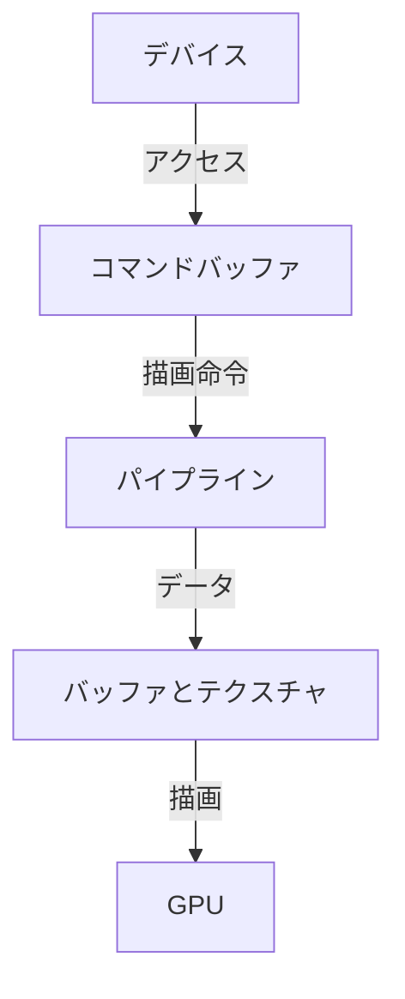

# WebGPUで実現する次世代グラフィックス：Three.jsとの連携と実装例

## はじめに

近年、Web技術の進化に伴い、ブラウザ上でのグラフィックス処理が飛躍的に向上しています。その中でも、WebGPUは次世代のグラフィックスAPIとして注目を集めています。WebGPUは、GPUを利用した高性能なグラフィックス処理を可能にし、Webアプリケーションにおけるリアルタイムレンダリングや計算処理を大幅に改善します。本記事では、WebGPUの基本概念、Three.jsとの連携方法、実装例を通じて、次世代グラフィックスの実現方法を詳しく解説します。

### WebGPUのアーキテクチャ

WebGPUのアーキテクチャを理解することは、効果的なグラフィックスプログラミングの第一歩です。以下のダイアグラムは、WebGPUの主要なコンポーネントとその関係を示しています。



このダイアグラムは、WebGPUのデバイスがコマンドバッファを介して描画命令を送信し、パイプラインを通じてバッファとテクスチャにデータを供給し、最終的にGPUで描画が行われる流れを示しています。

## WebGPUとは

### WebGPUの概要

WebGPUは、Webブラウザ上でGPUを利用した高性能なグラフィックス処理を行うためのAPIです。従来のWebGLに比べて、より低レベルのアクセスを提供し、パフォーマンスの向上を図っています。WebGPUは、Vulkan、Direct3D 12、MetalなどのモダンなグラフィックスAPIにインスパイアされており、これにより開発者はより効率的にGPUを活用できます。

### WebGPUの特徴

- **低レベルのアクセス**: WebGPUは、GPUリソースへの低レベルのアクセスを提供し、開発者はより細かい制御が可能です。これにより、パフォーマンスを最大限に引き出すことができます。たとえば、データの転送やシェーダーの最適化を行うことで、描画速度を向上させることができます。
  
- **非同期処理**: WebGPUは非同期処理をサポートしており、CPUとGPUの並行処理が可能です。これにより、パフォーマンスが向上し、フレームレートの安定性が増します。非同期処理を利用することで、ユーザーインターフェースの応答性を保ちながら、重い計算をバックグラウンドで実行できます。

- **クロスプラットフォーム**: WebGPUは、主要なブラウザでサポートされており、プラットフォームに依存しない開発が可能です。これにより、開発者は一度のコーディングで多くのデバイスに対応できます。特に、モバイルデバイスやタブレットでも高性能なグラフィックスを実現できる点が魅力です。

### WebGPUのアーキテクチャ

WebGPUは、以下の主要なコンポーネントで構成されています。

1. **デバイス**: GPUリソースへのアクセスを提供するオブジェクトで、コマンドを送信するためのインターフェースを持っています。デバイスは、GPUの機能を利用するためのエントリーポイントとなります。

2. **コマンドバッファ**: GPUに送信するコマンドを格納するためのバッファで、描画や計算の指示を含みます。コマンドバッファを使用することで、複数の描画命令を一度に送信し、効率的な処理が可能になります。

3. **パイプライン**: シェーダーやレンダリング設定を含むオブジェクトで、描画処理の流れを定義します。パイプラインを設定することで、異なるシェーダーやテクスチャを使用した描画が容易になります。

4. **バッファとテクスチャ**: GPUが使用するデータを格納するためのオブジェクトで、頂点データや画像データを含みます。これにより、3Dオブジェクトの形状や外観を定義することができます。

これらのコンポーネントを組み合わせることで、WebGPUは高性能なグラフィックス処理を実現します。

## Three.jsとの連携

### Three.jsとは

Three.jsは、WebGLを利用した3Dグラフィックスライブラリであり、開発者が簡単に3Dコンテンツを作成できるように設計されています。Three.jsは、シーン、カメラ、ライト、メッシュなどの基本的な3Dオブジェクトを簡単に扱うことができ、豊富な機能を提供します。特に、アニメーション、物理シミュレーション、ポストプロセッシングなどの機能が充実しており、開発者は複雑な3Dシーンを簡単に構築できます。

### WebGPUとThree.jsの統合

Three.jsは、WebGPUをサポートするための拡張が進められています。これにより、WebGPUのパフォーマンスを活かした3Dコンテンツの作成が可能になります。Three.jsのWebGPUサポートは、主に以下のような機能を提供します。

- **新しいレンダラー**: WebGPU用のレンダラーが追加され、WebGLレンダラーと同様のAPIを使用して3Dシーンを描画できます。これにより、既存のThree.jsのコードを大幅に変更することなく、WebGPUの利点を享受できます。

- **マテリアルとシェーダー**: WebGPUに最適化されたマテリアルとシェーダーが提供され、より高品質なレンダリングが可能です。これにより、リアルタイムでのライティングやシャドウの表現が向上します。

### Three.jsのWebGPUサポートの実装

Three.jsのWebGPUサポートを利用するためには、まずThree.jsの最新バージョンを使用する必要があります。次に、WebGPUレンダラーを設定し、シーンを構築します。

## 実装例

### 環境設定

まず、WebGPUを使用するための環境を整えます。以下の手順で、Three.jsとWebGPUを利用するための基本的なセットアップを行います。

1. **HTMLファイルの作成**: 新しいHTMLファイルを作成し、Three.jsとWebGPUのライブラリを読み込みます。

```html
<!DOCTYPE html>
<html lang="ja">
<head>
    <meta charset="UTF-8">
    <meta name="viewport" content="width=device-width, initial-scale=1.0">
    <title>WebGPU with Three.js</title>
    <script src="https://cdnjs.cloudflare.com/ajax/libs/three.js/r128/three.min.js"></script>
    <script src="https://cdn.jsdelivr.net/gh/mrdoob/three.js/examples/jsm/renderers/webgpu/WebGPURenderer.js"></script>
</head>
<body>
    <script src="app.js"></script>
</body>
</html>
```

2. **JavaScriptファイルの作成**: `app.js`という名前のJavaScriptファイルを作成し、基本的なThree.jsのシーンを設定します。

```javascript
import * as THREE from 'three';
import { WebGPURenderer } from 'three/examples/jsm/renderers/webgpu/WebGPURenderer.js';

const scene = new THREE.Scene();
const camera = new THREE.PerspectiveCamera(75, window.innerWidth / window.innerHeight, 0.1, 1000);
const renderer = new WebGPURenderer();
renderer.setSize(window.innerWidth, window.innerHeight);
document.body.appendChild(renderer.domElement);

const geometry = new THREE.BoxGeometry();
const material = new THREE.MeshBasicMaterial({ color: 0x00ff00 });
const cube = new THREE.Mesh(geometry, material);
scene.add(cube);

camera.position.z = 5;

function animate() {
    requestAnimationFrame(animate);
    cube.rotation.x += 0.01;
    cube.rotation.y += 0.01;
    renderer.render(scene, camera);
}

animate();
```

### コードの解説

上記のコードでは、基本的な3Dシーンを作成し、緑色の立方体を描画しています。以下に、各部分の詳細を説明します。

- **シーンの作成**: `THREE.Scene()`を使用して新しいシーンを作成します。シーンは、3Dオブジェクトを配置する空間を提供します。

- **カメラの設定**: `THREE.PerspectiveCamera`を使用して、視野角、アスペクト比、近くと遠くのクリッピングプレーンを設定します。これにより、3D空間の奥行きを表現できます。

- **WebGPURendererの初期化**: `WebGPURenderer`を使用して、WebGPUに最適化されたレンダラーを作成します。`setSize`メソッドで描画サイズを設定し、`renderer.domElement`をHTMLドキュメントに追加します。

- **立方体の作成**: `THREE.BoxGeometry`と`THREE.MeshBasicMaterial`を使用して、立方体のジオメトリとマテリアルを作成し、シーンに追加します。これにより、立方体が描画されます。

- **アニメーションループ**: `requestAnimationFrame`を使用して、立方体を回転させながらシーンを描画します。これにより、スムーズなアニメーションが実現されます。

### さらなる拡張

この基本的な実装を基に、さまざまな機能を追加することができます。以下にいくつかのアイデアを示します。

- **複雑なジオメトリ**: `THREE.SphereGeometry`や`THREE.PlaneGeometry`など、他のジオメトリを使用してシーンを拡張できます。これにより、より多様なオブジェクトを描画できます。

- **テクスチャの追加**: マテリアルにテクスチャを追加することで、よりリアルな表現が可能になります。テクスチャは、画像ファイルを使用してマテリアルに適用できます。

- **ライティングの追加**: `THREE.DirectionalLight`や`THREE.AmbientLight`を使用して、シーンにライティングを追加し、立体感を強調できます。ライティングの種類や強度を調整することで、シーンの雰囲気を変えることができます。

### 具体的な実装例

以下に、テクスチャとライティングを追加した具体的な実装例を示します。

```javascript
const textureLoader = new THREE.TextureLoader();
const texture = textureLoader.load('path/to/texture.jpg');

const materialWithTexture = new THREE.MeshBasicMaterial({ map: texture });
const texturedCube = new THREE.Mesh(geometry, materialWithTexture);
scene.add(texturedCube);

const light = new THREE.DirectionalLight(0xffffff, 1);
light.position.set(5, 5, 5).normalize();
scene.add(light);
```

このコードでは、テクスチャを読み込み、立方体に適用しています。また、方向性のある光源を追加し、シーンにライティングを加えています。

## WebGPUの利点と課題

### WebGPUの利点

- **パフォーマンスの向上**: WebGPUは、GPUのパフォーマンスを最大限に引き出すことができ、特に複雑なシーンやリアルタイムレンダリングにおいて顕著な効果を発揮します。これにより、より多くのオブジェクトやエフェクトを同時に描画できます。

- **新しい技術の活用**: WebGPUは、最新のグラフィックス技術を活用するための基盤を提供し、開発者は新しい機能を簡単に利用できます。これにより、よりリアルな表現やインタラクティブな体験を実現できます。

### WebGPUの課題

- **ブラウザのサポート**: 現在、WebGPUはすべてのブラウザでサポートされているわけではなく、特定のブラウザやバージョンに依存する場合があります。開発者は、ターゲットとするブラウザのサポート状況を確認する必要があります。

- **学習曲線**: WebGPUは低レベルのAPIであるため、従来のWebGLに比べて学習曲線が急である可能性があります。特に、シェーダープログラミングやGPUのアーキテクチャに関する知識が必要です。

## まとめ

WebGPUは、次世代のグラフィックスAPIとして、Webアプリケーションにおけるリアルタイムレンダリングの可能性を広げています。Three.jsとの連携により、開発者は高性能な3Dコンテンツを簡単に作成できるようになります。本記事では、WebGPUの基本概念、Three.jsとの統合方法、実装例を通じて、次世代グラフィックスの実現方法を解説しました。今後のWeb技術の進化に期待しつつ、WebGPUを活用した新しい体験を提供していきましょう。

-----

※本記事は生成AIを使用して作成されました。
AI言語モデル: gpt-4o-mini